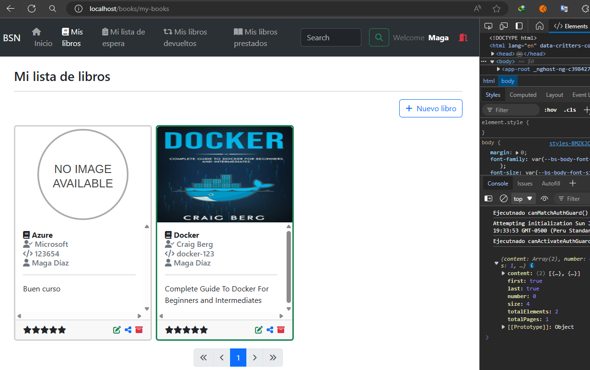

# Dockerizando el frontend (Angular)

---

**Referencias**

- [angular-docker: Get Arrays](https://github.com/magadiflo/angular-docker)

---

## Configura .dockerignore

Crearemos el archivo `.dockerignore` para evitar subir a la imagen que vamos a construir archivos y directorios innecesarios.

````dockerignore
**/.angular
**/.vscode
**/dist
**/node_modules
**/.git
**/README.md
**/LICENSE
**/npm-debug-log
**/coverage
**/.env
**/.editorconfig
**/.aws
**/assets_documentation
````

## Creando archivo de configuración nginx.conf

Cuando llevamos nuestra aplicación de Angular a un servidor como `nginx`, necesitamos realizar algunas configuraciones al
servidor para que nuestra aplicación de Angular funcione sin problemas. **¿Qué tipo de problemas?**, el más conocido es
cuando estamos en una ruta específica de nuestra aplicación de Angular, por ejemplo, supongamos que
estamos en la siguiente ruta `http://localhost/books/my-books` y le damos actualizar la página (F5), al hacerlo veremos que
nuestra aplicación se pondrá en pantalla en blanco, es como si no existiera esa ruta y eso está bien porque el servidor
`nginx` está tratando de buscar el directorio `/books/my-books` correspondiente a la ruta y obviamente no lo va a encontrar,
ya que nuestra aplicación es un `SPA` y las rutas que hemos creado son rutas, por decirlo así, "propias de Angular" o
"simulamos la existencia de dichas rutas", pero en realidad tenemos un único archivo que es el `index.html` donde todo se
está produciendo en dicho archivo.

Entonces, para que nuestras rutas sigan funcionando tal como lo hemos venido trabajando en desarrollo usando el `ng serve`,
necesitamos crear el siguiente archivo de configuración que luego será copiado al momento de crear la imagen de nuestra
aplicación de Angular desde nuestro Dockerfile.

````bash
events {}

http {
  # Incluye los tipos MIME globalmente
  include /etc/nginx/mime.types;
  default_type application/octet-stream;

  server {
    listen 80;

    # Definimos la ubicación por defecto
    location / {
      root /usr/share/nginx/html;
      index index.html;
      try_files $uri $uri/ /index.html;
    }

    # Capture todas las ubicaciones para manejar el refresh en cualquier ruta
    location ~ ^/.+$ {
      root /usr/share/nginx/html;
      index index.html;
      try_files $uri /index.html;
    }
  }
}
````

**DONDE**

- `include /etc/nginx/mime.types;` mueve esta directiva fuera del bloque location para que se aplique globalmente a todas
  las ubicaciones. Esto asegura que todos los tipos MIME definidos en el archivo mime.types sean reconocidos por Nginx.
- `default_type application/octet-stream;`, configura un tipo MIME predeterminado en caso de que Nginx no pueda determinar
  el tipo de contenido. Esto no es estrictamente necesario, pero es una buena práctica.

## Creando Dockerfile

Crearemos el `Dockerfile` que nos permitirá crear la imagen de nuestra aplicación de Angular. A continuación se muestra
las instrucciones.

````dockerfile
FROM node:20.12.2-alpine AS build-stage
WORKDIR /app
COPY package*.json ./
RUN npm install
COPY . .
RUN npm run build

FROM nginx:alpine AS run-stage
COPY nginx.conf /etc/nginx/nginx.conf
COPY --from=build-stage /app/dist/book-network-frontend/browser /usr/share/nginx/html
EXPOSE 80
````

Observar que en la línea `COPY nginx.conf /etc/nginx/nginx.conf` estamos copiando el archivo que creamos anteriormente hacia
dentro del contenedor. Esto significa que el archivo `nginx.conf` de tu máquina local será copiado y reemplazará al archivo
`nginx.conf` que ya está en la ruta `/etc/nginx/nginx.conf` dentro del contenedor.

Otro punto a observar es que como estamos utilizando `Angular 17` el directorio que se crea cuando se hace `build` de la
aplicación es `book-network-frontend/dist/book-network-frontend/browser`, es decir, en esta nueva versión de Angular, se
crea un nuevo directorio `/browser` y dentro de él todos los archivos de nuestra aplicación, eso incluye el
`index.html`, `styles`, `assets`, etc. es por eso que en el `Dockerfile` lo estamos usando así como directorio de origen donde
se encuentran todos los archivos listos para producción.

## Creando imagen de nuestra aplicación Angular

Ahora que ya tenemos nuestro `Dockerfile`, vamos a crear la imagen tal como se ve a continuación:

````bash
M:\PROGRAMACION\DESARROLLO_JAVA_SPRING\02.youtube\18.bouali_ali\08.full_web_application\book-social-network-02\book-network-frontend (main -> origin)

$ docker image build -t magadiflo/book-network-frontend:1.0.0 .                                                                          
[+] Building 1.9s (17/17) FINISHED                                                                                                       
 => [internal] load build definition from Dockerfile                                                                                     
 => => transferring dockerfile: 334B                                                                                                     
 => [internal] load metadata for docker.io/library/nginx:alpine                                                                          
 => [internal] load metadata for docker.io/library/node:20.12.2-alpine                                                                   
 => [auth] library/nginx:pull token for registry-1.docker.io                                                                             
 => [auth] library/node:pull token for registry-1.docker.io                                                                              
 => [internal] load .dockerignore                                                                                                        
 => => transferring context: 195B                                                                                                        
 => [run-stage 1/3] FROM docker.io/library/nginx:alpine@sha256:a45ee5d042aaa9e81e013f97ae40c3dda26fbe98f22b6251acdf28e579560d55          
 => [build-stage 1/6] FROM docker.io/library/node:20.12.2-alpine@sha256:7a91aa397f2e2dfbfcdad2e2d72599f374e0b0172be1d86eeb73f1d33f36a4b2 
 => [internal] load build context                                                                                                        
 => => transferring context: 9.12kB                                                                                                      
 => CACHED [run-stage 2/3] COPY nginx.conf /etc/nginx/nginx.conf                                                                         
 => CACHED [build-stage 2/6] WORKDIR /app                                                                                                
 => CACHED [build-stage 3/6] COPY package*.json ./                                                                                       
 => CACHED [build-stage 4/6] RUN npm install                                                                                             
 => CACHED [build-stage 5/6] COPY . .                                                                                                    
 => CACHED [build-stage 6/6] RUN npm run build                                                                                           
 => CACHED [run-stage 3/3] COPY --from=build-stage /app/dist/book-network-frontend/browser /usr/share/nginx/html                         
 => exporting to image                                                                                                                   
 => => exporting layers                                                                                                                  
 => => writing image sha256:783835307af03e941322420c93298e6f3f5a32cfdbb11723e7223d0cb9b953c1                                             
 => => naming to docker.io/magadiflo/book-network-frontend:1.0.0                                                                         
                                                                                                                                         
What's next:                                                                                                                             
    View a summary of image vulnerabilities and recommendations → docker scout quickview                                                 
````

**NOTA**
> Anteriormente, he venido creando esta versión de imagen por eso es que aparece como `CACHED`.

Verificamos que la imagen se ha creado exitosamente:

````bash
$ docker image ls
REPOSITORY                        TAG             IMAGE ID       CREATED             SIZE
magadiflo/book-network-frontend   1.0.0           783835307af0   About an hour ago   45.1MB
````

## Agrega servicio a Docker Compose

Como estamos trabajando con `docker compose` vamos a crear un nuevo servicio y utilizar la imagen de nuestra 
aplicación de Angular que creamos en el apartado anterior.

````yml
services:
  postgres:
    image: postgres:15.2-alpine
    container_name: c-postgres-bsn
    restart: unless-stopped
    environment:
      POSTGRES_DB: db_book_social_network
      POSTGRES_USER: magadiflo
      POSTGRES_PASSWORD: magadiflo
    ports:
      - 5435:5432
    volumes:
      - postgres_data:/var/lib/postgresql/data
    networks:
      - spring-net
    healthcheck:
      test: [ 'CMD-SHELL', 'pg_isready -U magadiflo -d db_book_social_network' ]
      interval: 10s
      timeout: 5s
      retries: 5

  mail-dev:
    image: maildev/maildev
    container_name: c-mail-dev-bsn
    restart: unless-stopped
    ports:
      - 1080:1080
      - 1025:1025
    networks:
      - spring-net

  book-network-backend:
    image: magadiflo/book-network-backend:1.0.0
    container_name: c-book-network-backend
    restart: unless-stopped
    ports:
      - 8080:8080
    networks:
      - spring-net
    depends_on:
      postgres:
        condition: service_healthy

  book-network-frontend:
    image: magadiflo/book-network-frontend:1.0.0
    container_name: c-book-network-frontend
    restart: unless-stopped
    ports:
      - 80:80
    networks:
      - spring-net

volumes:
  postgres_data:
    name: postgres_data

networks:
  spring-net:
    name: spring-net
````

**NOTA**
> El servicio `mail-dev` que crea el contenedor del servidor de correo podríamos eliminarlo, ya que en el backend modificamos los
> datos de conexión a un servidor de correos real (gmail), pero lo dejaremos ahí por si más adelante lo necesitamos.

Ahora que tenemos nuestra imagen construida y el servicio de nuestra aplicación definida en el archivo `compose.yml`, vamos a
posicionarnos mediante la línea de comandos en la raíz del proyecto donde se encuentra el archivo `compose.yml` y ejecutamos
el siguiente comando:

````bash
M:\PROGRAMACION\DESARROLLO_JAVA_SPRING\02.youtube\18.bouali_ali\08.full_web_application\book-social-network-02 (main -> origin)

$ docker compose up -d  
                       
[+] Running 0/0                                
[+] Running 5/5ng-net  Creating                
 ✔ Network spring-net                 Created  
 ✔ Container c-book-network-frontend  Started  
 ✔ Container c-mail-dev-bsn           Started  
 ✔ Container c-postgres-bsn           Healthy  
 ✔ Container c-book-network-backend   Started  
````

Verificamos que los contenedores se hayan creado correctamente:

````bash
$ docker container ls -a

CONTAINER ID   IMAGE                                   COMMAND                  CREATED          STATUS                      PORTS                                            NAMES
d26b9e65f77c   magadiflo/book-network-backend:1.0.0    "/__cacert_entrypoin…"   43 seconds ago   Up 29 seconds               0.0.0.0:8080->8080/tcp                           c-book-network-backend
05888d718855   magadiflo/book-network-frontend:1.0.0   "/docker-entrypoint.…"   43 seconds ago   Up 41 seconds               0.0.0.0:80->80/tcp                               c-book-network-frontend
f9b386ae9aef   postgres:15.2-alpine                    "docker-entrypoint.s…"   43 seconds ago   Up 41 seconds (healthy)     0.0.0.0:5435->5432/tcp                           c-postgres-bsn
ed04f89db034   maildev/maildev                         "bin/maildev"            43 seconds ago   Up 41 seconds (unhealthy)   0.0.0.0:1025->1025/tcp, 0.0.0.0:1080->1080/tcp   c-mail-dev-bsn
````

Finalmente, si accedemos a nuestra aplicación usando el navegador veremos que todo está funcionando correctamente:



